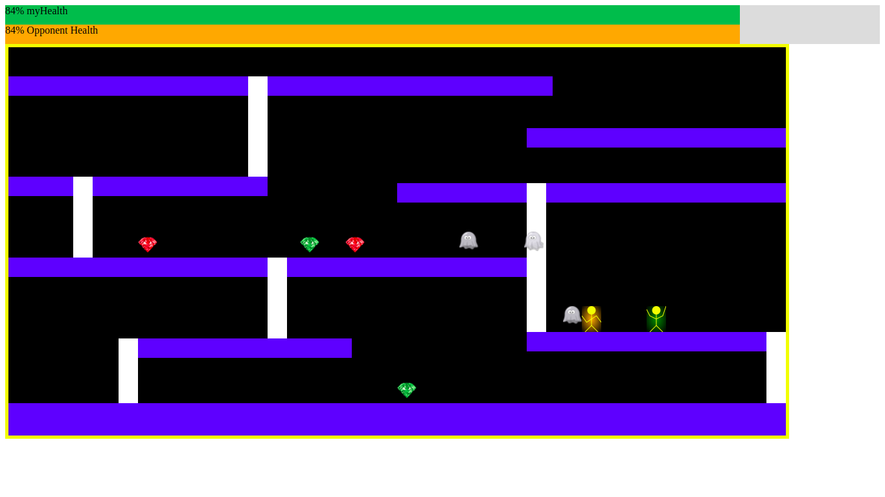

[](https://circleci.com/gh/IITH-SBJoshi/concurrency-3/tree/trial)

## PoPL-2 Project
# NodeRunner
## Group: concurrency-3



## Dependencies

* [golang websockets](https://github.com/gorilla/websocket) (Licensed under BSD-2)

## Tools Used

* godoc
* golint
* go vet
* go test
* golint

## Concurrency involved

* Health of both players decays with time. This is done by two go routines that run concurrently. When a player acquires a gem, the upadte has to be made safely. Mutex locks assure this safety.
* The events sent to server, have to be processed to update the game status. However, the message acceptance from the players have to be fair. This is ensured by the select-case block to extract from channels.
* Bots do not move randomly. They use Dijkstra's algorithm to find the path to nearest player. This involves execution of 6 Dijkstras in parallel. 6 channels are used in 6 go routines to accomplish the task.
* The server object is shared by both clients and all kinds of changes to it have to be done safely.
* Reading and writing from websockets can also happen concurrently. This also requires locks.


## CI

* travis-ci(never worked)
* circle-ci

## Controls

* Up    : Move up
* Down  : Move down
* Right : Move right
* Left  : Move left
* Space : **Teleport**

## Run Game

* Set IP and Port of server at web/js/game.js and web/js/wait.js in the statement
```javascript
ws = WebSocket("ws://<Server-IP>:<Server-Port>/<somehting>");
```
* create a server using
```bash
go run main.go
```

* Connect to server through your browser.(Internet Explorer is not allowed)

* PLay the game. Start the server again to play more!!!!!!!.


## Game Rules

Survive as long as you can to be the winner. 3 ghosts will always be on your tail so beware of them. But you have 10 teleports to jump to random locations. Green colored gems will increase your health and the red one will decrease opponent's health. So, choose your gems wisely. Once a gem is acquired, new gem will appear at some other location. Gems have a special property: green gems either multiply or add a value to your health, whereas red ones either subtract or divide opponents health.
